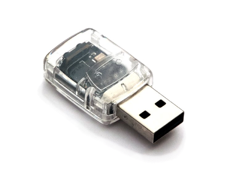

moninp
------
This tool maps Linux Input Device events into `mpc` commands that allow
you to control [mpd](https://www.musicpd.org/).

The whole code except the Key Press/Command mapping was written by [Ronium](http://unix.stackexchange.com/users/28489/runium)
You can find it on [Unix StackExchange](http://unix.stackexchange.com/a/94329)


I use this little program to control [Volumio](https://volumio.org/) with
[Xbox One Media Remote](http://www.xbox.com/en-GB/xbox-one/accessories/controllers/media-remote)
and [1st gen Flirc USB](https://flirc.tv/more/flirc-usb-v1)



# Provided mapping

This project uses my Flirc button mapping for Xbox One Media Remote which you 
can find in [xbox_one_media_remote_flirc_config.fcfg](https://github.com/kowalcj0/moninp/raw/master/xbox_one_media_remote_flirc_config.fcfg)


# Compile

You can build the binary with your own mappings by simply compiling the source
file with `gcc`.
```bash
gcc moninp.c -o monimp
```

PS. Volumio doesn't have `gcc` installed, so you can compile it on e.g.:
(Rasbian Jessie Lite](https://www.raspberrypi.org/downloads/raspbian/)


# Run:

```bash
sudo ./moninp /dev/input/event2
```

You can also provide device ID.
My [1st gen Flirc USB](https://flirc.tv/more/flirc-usb-v1) is identified as 
`/dev/input/by-id/usb-flirc.tv_flirc-event-kbd`. So you can start `moninp`
```bash
sudo ./moninp /dev/input/by-id/usb-flirc.tv_flirc-event-kbd
```

Run manually in the backgroud:
```bash
sudo sh -c 'nohup ./moninp /dev/input/by-id/usb-flirc.tv_flirc-event-kbd &'
```

To run it on Volumio start-up:

1. copy prefered `moninp_*` binary to `/usr/local/bin`
2. rename the `/usr/local/bin/moninp_*` binary to `/usr/local/bin/moninp`
3. copy  start-up script to `/etc/init.d/`
4. copy  to `/etc/systemd/system/moninp.service`
5. SSH onto your volumio
6. Check if `moninp` is NOT running with `systemctl status moninp.service`

```bash
volumio@volumio:/etc/systemd/system$ systemctl status moninp.service
● moninp.service - Input Device Event Monitor
   Loaded: loaded (/etc/systemd/system/moninp.service; disabled)
   Active: inactive (dead)

Apr 08 15:20:37 volumio systemd[1]: Starting LSB: Monitor Input Device Events...
Apr 08 15:20:37 volumio systemd[1]: Started LSB: Monitor Input Device Events.
Apr 08 15:20:37 volumio moninp[545]: Starting moninp...                                Ok
Apr 08 15:26:17 volumio systemd[1]: Stopping LSB: Monitor Input Device Events...
Apr 08 15:26:17 volumio moninp[1462]: Stopping moninp                                   /etc/init.d/moninp: line 56: kill: (550) - No such process
Apr 08 15:26:17 volumio moninp[1462]: Ok
Apr 08 15:26:17 volumio systemd[1]: Stopped LSB: Monitor Input Device Events.
```

7. Start `moninp` service with `systemctl start moninp.service`

```bash
volumio@volumio:/etc/systemd/system$ systemctl status moninp.service
● moninp.service - Input Device Event Monitor
   Loaded: loaded (/etc/systemd/system/moninp.service; disabled)
   Active: active (running) since Sat 2017-04-08 15:46:55 UTC; 2s ago
 Main PID: 1780 (moninp)
   CGroup: /system.slice/moninp.service
           └─1780 /usr/local/bin/moninp /dev/input/by-id/usb-flirc.tv_flirc-event-kbd

Apr 08 15:46:55 volumio systemd[1]: Started Input Device Event Monitor.
Apr 08 15:46:55 volumio moninp[1780]: Name      : flirc.tv flirc
Apr 08 15:46:55 volumio moninp[1780]: Version   : 1.0.1
Apr 08 15:46:55 volumio moninp[1780]: ID        : Bus=0003 Vendor=20a0 Product=0001 Version=0101
Apr 08 15:46:55 volumio moninp[1780]: ----------
```

8. Finally enable `moninp` service on start with `systemctl enable moninp.service`

If everything went smoothly, then you should see something like:

```bash
volumio@volumio:/etc/systemd/system$ systemctl enable moninp.service
Synchronizing state for moninp.service with sysvinit using update-rc.d...
Executing /usr/sbin/update-rc.d moninp defaults
insserv: warning: current start runlevel(s) (empty) of script `moninp' overrides LSB defaults (2 3 4 5).
insserv: warning: current stop runlevel(s) (0 1 2 3 4 5 6) of script `moninp' overrides LSB defaults (0 1 6).
Executing /usr/sbin/update-rc.d moninp enable
```

In some situations `Perl` might print some warnings, but you can ignore them.

```bash
volumio@volumio:/etc/systemd/system$ systemctl enable moninp.service
Synchronizing state for moninp.service with sysvinit using update-rc.d...
Executing /usr/sbin/update-rc.d moninp defaults
perl: warning: Setting locale failed.
perl: warning: Please check that your locale settings:
	LANGUAGE = (unset),
	LC_ALL = (unset),
	LC_COLLATE = "C",
	LANG = "en_GB.UTF-8"
    are supported and installed on your system.
perl: warning: Falling back to the standard locale ("C").
insserv: warning: current start runlevel(s) (empty) of script `moninp' overrides LSB defaults (2 3 4 5).
insserv: warning: current stop runlevel(s) (0 1 2 3 4 5 6) of script `moninp' overrides LSB defaults (0 1 6).
Executing /usr/sbin/update-rc.d moninp enable
perl: warning: Setting locale failed.
perl: warning: Please check that your locale settings:
	LANGUAGE = (unset),
	LC_ALL = (unset),
	LC_COLLATE = "C",
	LANG = "en_GB.UTF-8"
    are supported and installed on your system.
perl: warning: Falling back to the standard locale ("C").
```

# Using your own mapping

If you'd like to change the mapping, then ATM you will have to:

1. run `monimp` binary for your selected input device
2. press a button on your remote
3. find the button `code` for an event with `type=00` & `value=00` (key up)

e.g.: in the example below we're after `code` from line number `5` (2nd would work too :) )
```bash
1491342238.860640: type=04 code=04 value=c00cd
1491342238.860640: type=01 code=a4 value=01
1491342238.860640: type=00 code=00 value=00
1491342239.020638: type=04 code=04 value=c00cd
1491342239.020638: type=01 code=a4 value=00
1491342239.020638: type=00 code=00 value=00
1491342244.333333: type=04 code=04 value=c00b3
1491342244.333333: type=01 code=d0 value=01
```
4. add new mapping for this `code` or replace existing one
5. compile, upload binary to your `mpd` powered player and enjoy

# Futurue work

* load mappings from a simple properties file
* autodetect Flirc device

